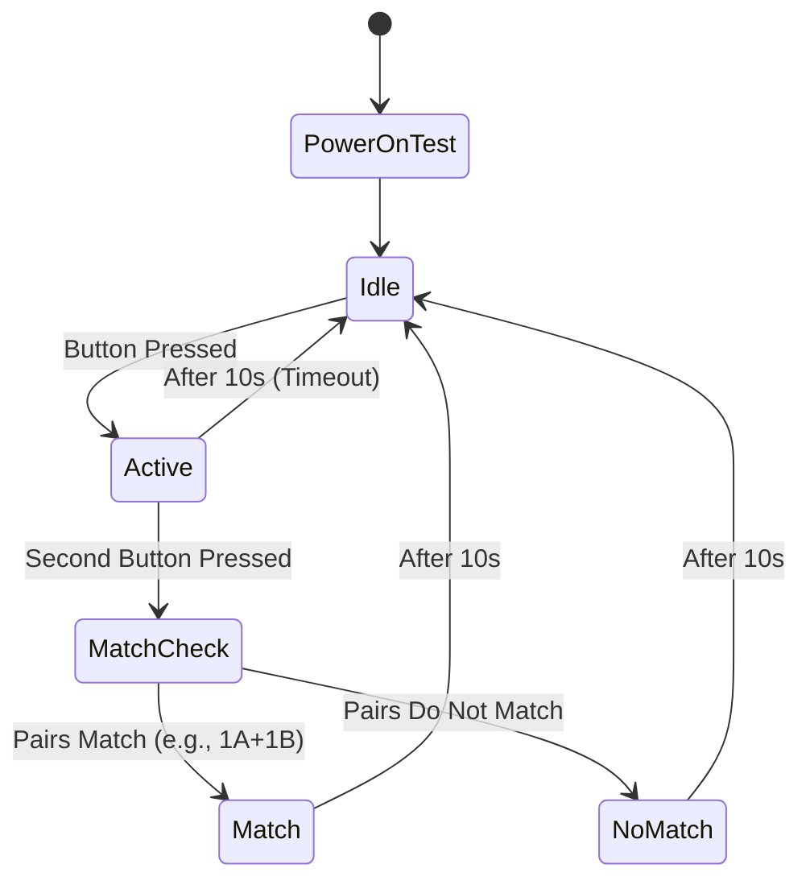

# **Memory Game: Design & Implementation Document**
**Project:** Vonk Gespreksstarters (Museum Installation)
**Target Device:** ESP32-S3-WROOM1
**Author:** Roy Bens
**Audience:** Claude Opus 4.7 (Developer)
**Last Updated:** May 4, 2026

---

## **1. Background & Context**
### **1.1 Project Overview**
This document describes the **Memory Game** for a museum installation with the theme *"Old and New"*. The game is one of three interactive games in a physical build (the games run independently with their own hardware). The Memory Game uses **10 boxes**, each containing a pair of old and new objects (e.g., rotary phone + iPhone, record player + Sonos speaker). Visitors press buttons to find matching pairs, with visual feedback via RGBW LED strips. 

### **1.2 System Architecture**
- **Hardware:**
  - **ESP32-S3-WROOM1**: Central microcontroller running the Memory Game.
  - **Raspberry Pi 5**: Runs the other two games; **hardwired to ESP32 via USB** for remote access/updates to the ESP controller.
  - **10× SK6812 RGBW LED Strips**: Varying lengths (120–300 cm, 72–180 LEDs each).
  - **10× NO (Normally Open) Buttons**: One per box, high-quality steel vandalproof pushbuttons.
  - **2× TXS0108E Level Shifters**: For 3.3V→5V conversion on LED data lines.
  - **Mean Well 5V/30A Power Supply**: Powers all LED strips and ESP32.
  - **CNC Patch Panel**: 20× GX12 sockets (labeled **1A, 1B, 2A, ..., 5B**) for modular box connections. (10 * 2 pin sockets for buttons, 10 * 3 pin for led strips).

- **Topology:**
  - **Star topology**: All boxes connect to the central CNC panel, which wires to the ESP32 and power supply. The panel enables swapping boxes/matches by simply replugging the cable.
  - **ESP32 GPIO Mapping**: Fixed 20 pins (10 for buttons, 10 for LED data) matching socket labels (e.g., `GPIO 1 = 1A button`, `GPIO 11 = 1A LED data`).

### **1.3 Goals**
- **Simplicity**: Barebones implementation with no start/end, no scoring, no sound.
- **Robustness**: 10-year lifespan in a museum with **no manual intervention**.
- **Modularity**: Boxes can be rearranged (e.g., swap 1A and 3B) without code changes.
- **Remote Maintenance**: ESP32 firmware updates and debugging via **RPi5 SSH bridge**.

---

## **2. Requirements**
### **2.1 Functional Requirements**
| ID   | Requirement                                                                 |
|------|-----------------------------------------------------------------------------|
| FR1  | All 10 boxes start in **idle state** (20% brightness, white color).       |
| FR2  | Pressing a button activates the box (**blue pulse, 0–40% brightness**).   |
| FR3  | Pressing a second button activates it and checks (small delay) for a **match** (1A+1B, 2A+2B, etc.). |
| FR4  | On match: Both boxes turn **green**. On no match: Both turn **red**.       |
| FR5  | All non-idle states **auto-reset to idle after 10 seconds**.              |
| FR6  | Game loop is **infinite** (no start/end; visitors can join/leave anytime).|
| FR7  | **No sound, no score, no players, no screen output.**                      |
| FR8  | On power-on, cycle all LED strips through **red, green, blue** before settling to idle state. |

### **2.2 Non-Functional Requirements**
| ID   | Requirement                                                                 |
|------|-----------------------------------------------------------------------------|
| NFR1 | **Power Efficiency**: Stay under 150W (5V/30A) by limiting brightness and using RGBW white instead of R+G+B. |
| NFR2 | **Durability**: Uses GX12 connectors and level shifters for 10-year reliability. |
| NFR3 | **Remote Access**: ESP32 must be flashable/debuggable via **RPi5 SSH bridge**. |
| NFR4 | **Code Maintainability**: Modular, well-commented, and easy to update.       |
| NFR5 | **Hardware Agnostic**: Code must work regardless of LED strip length (72–180 LEDs). |

### **2.3 Assumptions**
- **LED Strips**: All are SK6812 RGBW, addressable, and powered by 5V.
- **Buttons**: NO (Normally Open), wired to GPIO with `INPUT_PULLUP`, **50ms debounce time**.
- **Power**: 5V/30A PSU is sufficient if brightness is limited.
- **ESP32-S3**: 3.3V logic; **level shifters required for LED data lines (5V)**.
- **RPi5**: Always online and accessible via Tailscale/SSH.

---

## **3. Hardware Design**
### **3.1 Component List**
| Component               | Quantity | Notes                                  |
|-------------------------|----------|----------------------------------------|
| ESP32-S3-WROOM1         | 1        | Central controller.                    |
| TXS0108E Level Shifter  | 2        | 16 channels (10 used for LED data).     |
| SK6812 RGBW LED Strip   | 10       | 72–180 LEDs each.                      |
| NO Button               | 10       | One per box, steel vandalproof.        |
| GX12 Connectors         | 20       | 2 per box (2-pin for button, 3-pin for LED). |
| Screw Terminal Adapter | 1        | For ESP32 GPIO connections.            |
| Mean Well 5V/30A PSU    | 1        | Powers all strips and ESP32.           |

### **3.2 Wiring Diagram**
#### **ESP32 ↔ CNC Panel**
- **Buttons**: ESP32 GPIO **1–10** → Buttons (1A–5B) → GND.
  - Use `INPUT_PULLUP` (no external resistors).
- **LED Data**: ESP32 GPIO **11–20** → TXS0108E (3.3V side) → LED data lines (5V side).
  - **TXS0108E**:
    - `VCCA = 3.3V` (ESP32), `VCCB = 5V` (PSU).
    - Channels A1–A10 → ESP32 GPIO 11–20.
    - Channels B1–B10 → LED data lines (1A–5B).
- **Power**:
  - **5V/GND** from PSU → All LED strips (via CNC panel).
  - **ESP32 Power**: 5V → ESP32’s `5V` pin (or USB from RPi5).

#### **RPi5 ↔ ESP32**
- **USB-A (RPi5) → USB-C (ESP32)**: For remote flashing/debugging.

---
### **3.3 GPIO Mapping**
| Socket | Button GPIO | LED Data GPIO | Notes               |
|--------|-------------|---------------|---------------------|
| 1A     | 1           | 11            |                     |
| 1B     | 2           | 12            |                     |
| 2A     | 3           | 13            |                     |
| 2B     | 4           | 14            |                     |
| 3A     | 5           | 15            |                     |
| 3B     | 6           | 16            |                     |
| 4A     | 7           | 17            |                     |
| 4B     | 8           | 18            |                     |
| 5A     | 9           | 19            |                     |
| 5B     | 10          | 20            |                     |

---
## **4. Software Design**
### **4.1 Libraries**
| Library          | Purpose                          | Notes                                  |
|------------------|----------------------------------|----------------------------------------|
| NeoPixelBus      | Drive SK6812 RGBW strips.        | Use `NeoGrbwFeature` for RGBW support. |
| Bounce2          | Button debouncing.               | **50ms debounce time**.                |

### **4.2 State Machine**


### **4.3 Game Logic**
1. **Power-On Test**:
   - On boot, cycle all LED strips through **red → green → blue** (1s each), then proceed to idle state.

2. **Idle State**:
   - All strips: **White, 20% brightness**.

3. **Active State**:
   - Pressed box: **Blue pulse (0–40% brightness)**.

4. **Match Check**:
   - If two active boxes are a **predefined pair** (e.g., 1A+1B), turn both **green**.
   - Else, turn both **red**.

5. **Reset**:
   - All states auto-revert to **idle after 10 seconds**.

### **4.4 Code Structure**
```
/memory-game
├── src/
│   ├── main.cpp          # setup(), loop(), state machine
│   ├── led_control.cpp   # NeoPixelBus initialization/updates
│   ├── button_handler.cpp # Debounce (50ms), press logic
│   ├── config.h          # GPIO mapping, pairs, timeouts
│   └── states.h          # State definitions (IDLE, ACTIVE, etc.)
├── platformio.ini        # Build config (ESP32-S3, libraries)
└── README.md             # This document
```

---
## **5. Development & Testing Workflow**
### **5.1 Local Development (Laptop)**
1. **Setup**:
   - Install [PlatformIO](https://platformio.org/) in VSCode.
   - Open project: `pio init --board esp32-s3-devkitc-1`.
2. **Flashing**:
   - Connect ESP32 via USB.
   - Run: `pio run --target upload`.
3. **Testing**:
   - Use **Serial Monitor** (115200 baud) to simulate inputs:
     - Send `1A` to simulate pressing button on socket 1A.
     - Expected output:
       ```
       [POWER-ON] Cycling all strips: RED → GREEN → BLUE
       [IDLE] All: WHITE (20%)
       > 1A
       [ACTIVE] 1A: BLUE (pulse)
       > 1B
       [MATCH] 1A: GREEN, 1B: GREEN
       [RESET] 1A: WHITE, 1B: WHITE (after 10s)
       ```
   - **LED Simulation**: Replace `NeoPixelBus` calls with `Serial.print()` for testing.

### **5.2 Remote Maintenance (Museum)**
1. **SSH into RPi5**:
   ```bash
   ssh pi@rpi5-museum.local
   ```
2. **Access ESP32 Serial**:
   ```bash
   screen /dev/ttyACM0 115200
   ```
3. **Flash New Firmware**:
   ```bash
   esptool.py --port /dev/ttyACM0 write_flash 0x0 .pio/build/esp32-s3-devkitc-1/firmware.bin
   ```

---
## **6. Deployment**
### **6.1 Technician Tasks**
1. **Wire ESP32 to Perfboard**:
   - Connect **20 GPIO pins** to screw terminal adapter.
   - Wire **level shifters** (TXS0108E) between ESP32 and LED data lines.
   - Connect **5V/GND** from PSU to LED strips and ESP32.
2. **Verify Connections**:
   - Check continuity for all 20 GPIO + power/ground lines.
   - Test one LED strip and button before full assembly.

### **6.2 Final Checks**
- [ ] All 10 LED strips cycle through red/green/blue on power-on.
- [ ] All 10 LED strips settle to white (20%) in idle state.
- [ ] Button presses trigger state changes (blue → green/red).
- [ ] Auto-reset works after 10 seconds.
- [ ] No flickering or power issues (adjust brightness if needed).

---
## **7. Power Management**
- **Max Current Estimate**:
  - 10 strips × 180 LEDs × 60mA (white @ 50%) ≈ **10.8A** (well under 30A).
- **Optimizations**:
  - Use **RGBW white** (not full RGB) for idle state.
  - Limit brightness to **≤50%** (adjustable in `config.h`).

---
## **8. References**
- [ESP32-S3 Datasheet](https://www.espressif.com/sites/default/files/documentation/esp32-s3_datasheet_en.pdf)
- [NeoPixelBus Library](https://github.com/Makuna/NeoPixelBus)
- [TXS0108E Datasheet](https://www.ti.com/lit/ds/symlink/txs0108e.pdf)
- [SK6812 RGBW Datasheet](https://datasheet.lcsc.com/lcsc/1810141430_Shenzhen-Sunrise-Elec-SK6812-RGBW_C216932.pdf)

---